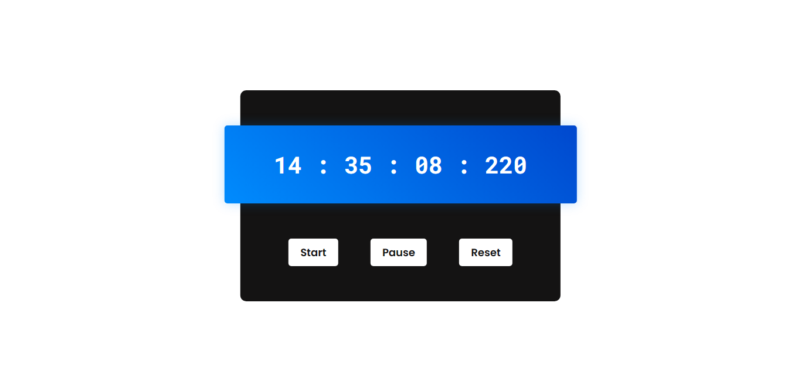

<h1 align="center"> Stopwatch </h1>

Um stopwatch, ou cronômetro usando HTML, CSS and Javascript Vanila.

  <a href="#-tecnologias">Tecnologias</a>&nbsp;&nbsp;&nbsp;|&nbsp;&nbsp;&nbsp;
  <a href="#-projeto">Projeto</a>&nbsp;&nbsp;&nbsp;|&nbsp;&nbsp;&nbsp;
  <a href="#-contato">Contato</a>

  

 

  

## 🚀 Tecnologias

Esse projeto foi desenvolvido com as seguintes tecnologias:

- HTML
- CSS
- JavaScript DOM

## 💻 Projeto

Um projeto daorinha, desenvolvido por conta desse [vídeo](https://www.youtube.com/watch?v=3Re18DCjJ4s&list=PLNCevxogE3fgy0pAzVccadWKaQp9iHspz&index=8) do [Coding Artist](https://www.youtube.com/@CodingArtist)

🔗 [Clique aqui para acessar](https://matheusfdosan.github.io/stopwatch/)

## Contato

- Acesse também meus outros repositórios no [Github](https://github.com/matheusfdosan?tab=repositories).

- Também me siga no [Instagram](https://instagram.com/matheusfdosan).
